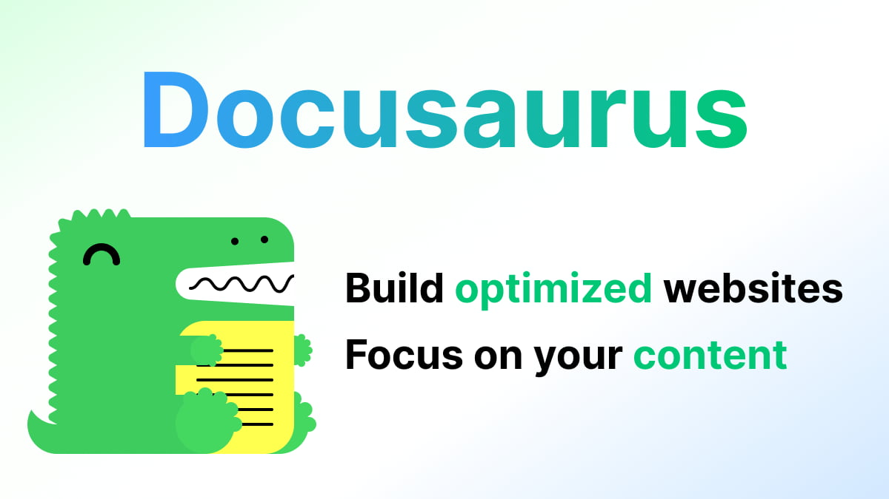

# Welcome to the all new GeauxWeisbeck4.dev!

I have been debating for quite sometime on how I wanted to redesign my pillar developer portfolio site, [GeauxWeisbeck4.dev](https://GeauxWeisbeck4.dev). The last rendition I did, version 2.0, turned out to be horrendous in my opinion. Part of the reason was I was being kicked out of my apartment and was staring homelessness in the face. The other part is that I had been trying to think of the coolest website I possibly could for two months without any actual designing or planning, which resulted in me throwing everything into a shitty boiling spaghetti pot and throwing those shitty web dev noodles at the wall - and unfortunately they fucking stuck to that wall and got deployed to the universe.

To myself, my family, my (most likely not happening) future kids, and to my most precious mentor I've never met, Wes Bos: please accept my apology for the shame I have brought onto you with this scatter-brained attempt at a web developer portfolio. I truly was not myself at that time, nor did I realize that what I deployed and called my portfolio was something of a Mary Shelley nightmare that was hacked together with spit and duct tape. Please accept this next version as a token of my remorse and may Stack Overflow leave all of you alone for this action and place it all upon me, the one who brought you shame...

Did somebody just say it wasn't that bad? Who the $&%6 said that? Ok, let me sit you down Mr. "I don't want to hurt your feelings so I'm gonna lie to you" and let me show you what is so bad about GeauxWeisbeck4.dev Version 2.0.

## It's an Unresponsive Piece of Shit

One of the first things I noticed after deploying this website (besides that it sucked really bad), was that it was an unresponsive piece of shit. The only screen it works on is if you maximize the window on your computer at home - and if your screen is smaller than my 14" Mac Book, it doesn't even fit! Blaaargh!

## Next Generation Bullshit!

I won't rail against my services I offer, because they are typically impecable - great customer service, smooth design process that provides results, and follow up post deployment that makes you feel like I'm working for you forever... but this picture makes that promise look like a man caught mid-affair with his mistress in his own bed - by his children. The children don't know whats really going on but all they know is that daddy isn't with mommy and whatever they're doing feels really wrong. A potential client feels the same way - they think what I'm saying may make sense to a crazy person, but they aren't really sure because the design is horrible and it feels wrong that I'm making big claims on the backdrop of such a horrible design. Ugghhh!

## Worst Piece of Shit for Last - the "blog page"

Before I share this - please know that I do know how to write JavaScript and how to map out blog posts to be generated on a website like a real web developer. I don't know what I got into the night I did this, but part of it I remember was that I couldn't get Deno to play nice with my code. But nonetheless, here we are:

Go ahead and try clicking on the blog link in the top navbar - it goes to [GeauxWeisbeck4.deno.dev](https://geauxweisbeck4.deno.dev), my personal Deno blog, made with Deno and deployed on Deno Deploy. What's the problem you say? Well scroll down on the first page and click on the blog posts in the second picture and we get what you see on the bottom of the picture - shitty posts on my Medium blog. THERE IS NO ACTUAL BLOG PAGE CODED INTO MY WEBSITE - THATS HORRIBLE! BLAARGH BLAH BLAH.....

## There is a Solution - Docusaurus

Now, did you think I really wanted to just pop my info into a website statically generated by Docusaurus and copy and paste my info into the classic template? Well, it was actually kind of fun... but no, ultimately not really. It doesn't allow me to completely show off my creativity and personality like writing one from scratch does. But it does allow me to accomplish my goals for my portfolio site - write about my accomplishments and what I know about important stuff. Sacrificing free range on every aspect of my portfolio website in exchange for an opinionated solution is a small price to pay for impressing potential clients and employers.

Version 2.0 wasn't impressing no one, so I'll take Docusaurus all day long. Plus Docusaurus aint so bad after all - it uses React, and an has easy to implement docs sidebar and awesome [Docusaurus blogging features](https://docusaurus.io/docs/blog) that are powered by the [Docusaurus blog plugin](https://docusaurus.io/docs/api/plugins/@docusaurus/plugin-content-blog). Plus, you can see how many awesome websites and digital products use Docusaurus for their own documenation and/or landing page here on [the Docusaurus showcase page](https://docusaurus.io/showcase).

I'll just spend all my creativity points on my writing for my blog, which serves as a place for writing about developer things. I'll even include some of my [dev journal entries that are typically posted in my digital garden](https://andrewsdigital.garden), which you should totally check out and follow!

## So that's it? Docusaurus to show off your personality?

No, no, no... you're missing the point! Docusaurus is to showcase all of my professional strengths through documentation, coding notes, and blogging. It is supposed to be a more technical representation of what I can do, where my other personal site, [andrewweisbeck.dev will showcase my creativity and personality](https://andrewweisbeck.dev). Yup! Two Andrew Weisbeck websites are coming at y'all before my 32nd birthday!

When will my other site drop you ask? It could be tomorrow, it could be next week - all I know is that it will be before or on May 15th, 2023.

## Conclusion - thanks for checking out my site!

I hope you didn't find my humor too stupid and dry or my review of my old website too cruel and harsh on my former self. I just wanted to poke fun at my former myself for a site that I was super angry for sharing with the world and leaving it up for two and half months, possibly scaring away recruiters and new friends... Oh, well! Now I got this new one!

Thank you for reading this post! I hope you found it entertaining and refreshing. There will be more to come as this site grows and evolves with my career!

**Did you like this post? Read more about Andrew on [the about page](/about) or on any of his other sites on the links part of the about page.**
